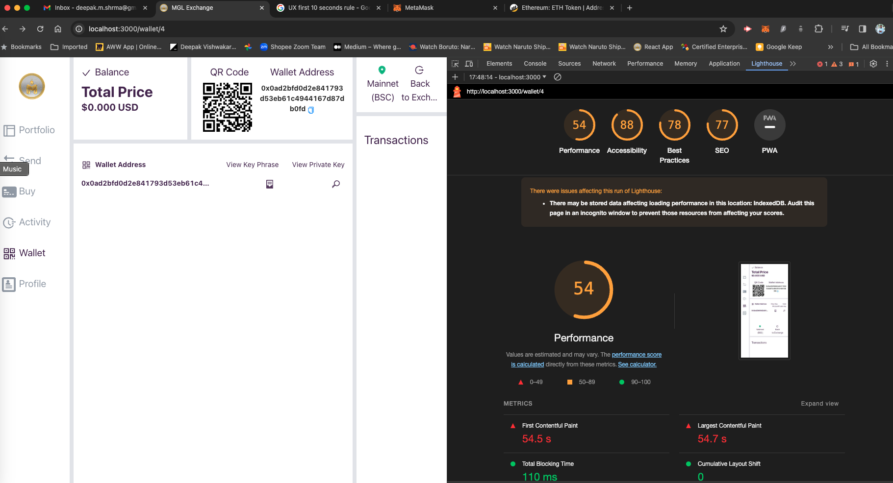
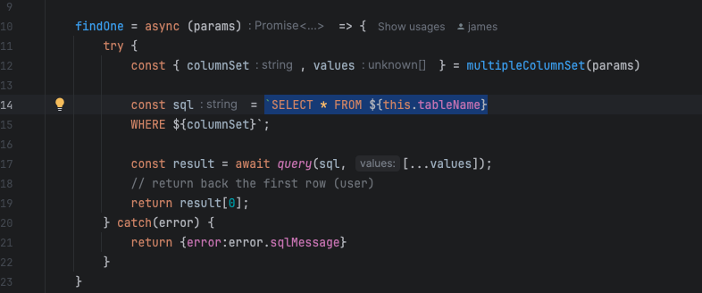
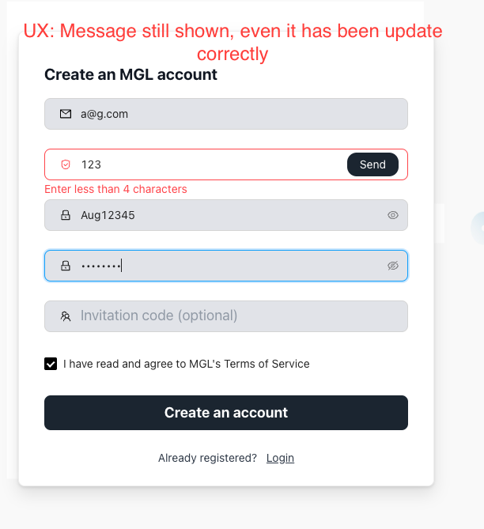
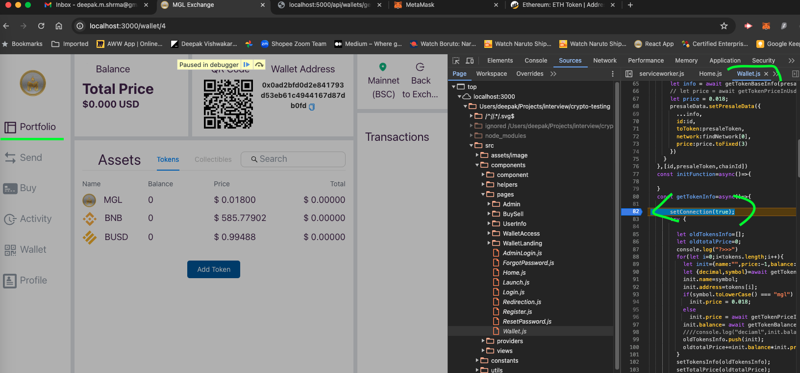

# Findings

## Major issues

1. Performance - Call can be merged and done async in parallel calls. Some places, it is in series of calls. which
   delays UI
2. Powers of 10 - UI is laggy and slow which lead to bad SEO
3. Poor SEO
   
4. Outdated module, having a lot of vulnerability issues. `npm audit fix --force`
5. Use containerization for local development. - `docker-compose.yml`

## Minor Issues

1. Latest node version support is not available[NODE_OPTIONS=--openssl-legacy-provider]
2. Eslint fix, Duplicate keys, use of == instead of === many more.
3. SQL injection - RAW database query

4. Missing limit, pagination in database queries
5. Vulnerable inject of script [ieo.route.js](backend/src/routes/api/ieo.route.js)
6. Missing function/user level access control
7. Sensitive data exposure like keys and password

## Code practice
1. Code standard should be updated to ES6 and above.
2. Use of class with in node backend, It could be easily exported as functions.
3. Init database script is missing

## UX Issues

1. Invalid error message
   
2. Set interval is not unsubscribed even use switch to another page.
   
3. User is logged in still showing for registration
   
4. 